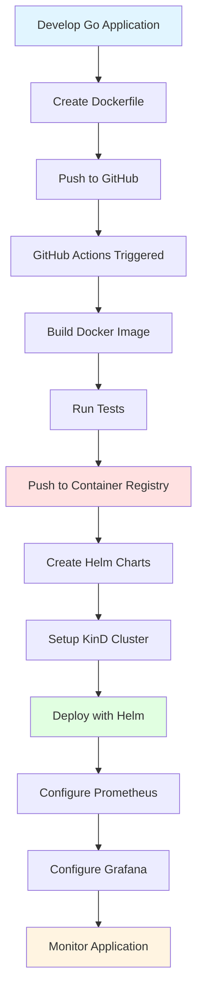

# Orchestrated Ping-Pong Service
Learning Cloud Native Computing Foundation (CNCF) Technologies

## Overview
This project demonstrates a complete cloud-native application lifecycle by building and deploying a simple ping-pong REST service to a Kubernetes cluster. The service responds to ping requests with pong responses, serving as a practical example for learning modern DevOps and cloud-native practices.

## Technology Stack

### Core Technologies
- **Application**: Go (Golang) REST API
- **Containerization**: Docker
- **Orchestration**: Kubernetes
- **Package Management**: Helm
- **CI/CD**: GitHub Actions
- **Container Registry**: Docker Hub / GitHub Container Registry
- **Local Development**: KinD (Kubernetes in Docker)

### Monitoring Stack
- **Metrics**: Prometheus
- **Visualization**: Grafana

### Optional/Advanced
- **Infrastructure as Code**: Terraform
- **GitOps**: ArgoCD

## Workflow

### Implementation Steps

1. ✅ **Application Development**
   - Develop a simple Go REST API with `/ping` endpoint returning `pong`
   - Implement health check endpoints (`/health`, `/ready`)
   - Add structured logging

2. ✅ **Containerization**
   - Create multi-stage Dockerfile for optimized image size
   - Configure container security best practices
   - Test container locally

3. ✅ **CI/CD Pipeline**
   - Set up GitHub Actions workflow
   - Automate building and pushing images
   - Implement semantic versioning for images

4. ✅ **Container Registry**
   - Configure Docker Hub or GitHub Container Registry
   - Set up image scanning for vulnerabilities
   - Implement retention policies

5. ✅ **Helm Charts**
   - Create Helm chart structure (go-ping + nginx-proxy charts)
   - Define deployment, service, and ingress resources
   - Configure values for different environments
   - Add security contexts, health probes, and HPA support
   - Multi-architecture image support (AMD64 + ARM64)

6. ✅ **Local Kubernetes Setup**
   - Deploy KinD cluster
   - ⏭️ Configure local registry (optional - skipped)
   - Set up kubectl context

7. ✅ **Application Deployment**
   - Deploy application using Helm (go-ping + nginx-proxy)
   - Configure service exposure (ClusterIP, LoadBalancer)
   - Test connectivity (all endpoints verified via port-forward and proxy)

8. **Monitoring Setup**
   - Deploy Prometheus for metrics collection
   - Configure Grafana dashboards
   - Set up alerts for critical metrics

9. **Optional: Infrastructure as Code**
   - Define cluster infrastructure with Terraform
   - Manage cloud resources declaratively

10. **Optional: GitOps with ArgoCD**
    - Set up ArgoCD for continuous deployment
    - Configure automatic sync from Git repository

## Resources
* https://landscape.cncf.io/ 