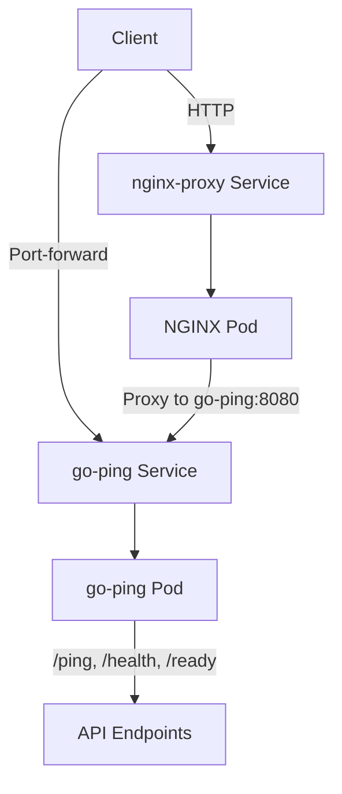

# Helm Charts

This directory contains Helm charts for deploying the orchestrated-ping application and its optional NGINX reverse proxy.

## Background

This project demonstrates modern cloud-native deployment patterns using Kubernetes and Helm. The charts are designed to showcase:

- **Modular architecture**: Services can be deployed independently or together
- **Production-ready practices**: Security contexts, health probes, resource limits, and graceful shutdown
- **Flexibility**: Multiple deployment options from local development to production environments
- **Infrastructure as Code**: Declarative configuration management using Helm

The application itself is a lightweight Go-based HTTP service that responds to ping requests, but the real value lies in demonstrating how to properly package, configure, and deploy cloud-native applications.

## Architecture

### Chart Structure

```
charts/
├── go-ping/          # Core application chart
│   ├── templates/    # Kubernetes manifests
│   └── values.yaml   # Configuration
├── nginx-proxy/      # Optional reverse proxy chart
│   ├── templates/
│   └── values.yaml
└── README.md         # This file
```

### Deployment Options

#### Option 1: Standalone go-ping (Simple)

```
Internet/Users
    ↓
Port-forward or LoadBalancer
    ↓
go-ping Service (ClusterIP)
    ↓
go-ping Pods
```

**Use case**: Development, testing, simple deployments

**Characteristics**:
- Direct access to the application
- Minimal resource overhead
- Fastest deployment
- Suitable for internal services

#### Option 2: go-ping + NGINX Proxy (Production)

```
Internet/Users
    ↓
LoadBalancer/Ingress
    ↓
nginx-proxy Service
    ↓
NGINX Pods (reverse proxy)
    ↓
go-ping Service (ClusterIP)
    ↓
go-ping Pods
```

**Use case**: Production deployments, advanced routing needs

**Characteristics**:
- Dedicated reverse proxy layer
- Custom NGINX configuration capabilities
- Request/response transformation
- Advanced caching and rate limiting
- SSL/TLS termination at proxy layer
- Isolated from backend changes

### Component Interaction



## Design Philosophy

### Why Two Separate Charts?

**Principle: Loose Coupling**

We deliberately split the application and proxy into separate charts rather than making NGINX optional within the go-ping chart. Here's why:

#### 1. **Independence**
- go-ping works perfectly fine on its own
- No need to deploy unnecessary components
- Cleaner separation of concerns
- Each chart has a single, clear purpose

#### 2. **Flexibility**
- Deploy only what you need
- Easy to swap NGINX for another proxy (Envoy, Traefik, etc.)
- Different lifecycles: update go-ping without touching NGINX
- Different teams can own different components

#### 3. **Reusability**
- NGINX chart can proxy to other services, not just go-ping
- go-ping can be consumed by different proxies or ingress controllers
- Configuration is independent and composable

#### 4. **Simplicity**
- Each chart is easier to understand
- Less conditional logic in templates
- Clearer mental model for users
- Better separation of configuration

### Why Not Use Kubernetes Ingress?

The nginx-proxy chart provides capabilities beyond standard Ingress:

| Feature | Kubernetes Ingress | Custom NGINX Chart |
|---------|-------------------|-------------------|
| Basic routing | ✅ | ✅ |
| Path-based routing | ✅ | ✅ |
| Custom NGINX modules | ❌ | ✅ |
| Advanced caching | Limited | ✅ Full control |
| Request transformation | Limited | ✅ Lua scripting |
| Fine-grained rate limiting | Limited | ✅ Custom rules |
| Custom error pages | Limited | ✅ Full control |
| WebSocket tuning | Basic | ✅ Advanced |
| Dedicated resources | Shared | ✅ Isolated |

**When to use what:**
- **Kubernetes Ingress**: Standard HTTP/HTTPS routing, multiple services, TLS termination, cost-effective
- **Custom NGINX chart**: Advanced features, custom logic, isolated proxy, specific compliance needs

### Configuration Strategy

Both charts follow Helm best practices:

- **Sensible defaults**: Works out-of-the-box for development
- **Production-ready options**: All necessary knobs for production tuning
- **Security by default**: Non-root users, read-only filesystems, resource limits
- **Observability**: Health probes, structured logging, metrics-ready

### Resource Philosophy

**go-ping**: Minimal resources (20m CPU, 20Mi memory)
- Demonstrates efficient Go applications
- Shows realistic microservice sizing
- Suitable for resource-constrained environments

**nginx-proxy**: Moderate resources (50m-100m CPU, 32-64Mi memory)
- Reflects real-world proxy requirements
- Scales independently of backend
- Buffer for request handling

## Usage Patterns

### Prerequisites
- **Kubernetes Cluster**: Minikube, KinD, or cloud provider
- **Helm 3.x**: Installed and configured
- **kubectl**: Configured to access your cluster

#### Starting a Local Cluster with KinD

```bash
kind create cluster --name orchestrated-ping
kubectl cluster-info --context kind-orchestrated-ping
```

#### Start the chart deployments

```bash
# 1. Deploy go-ping application
helm install go-ping ./charts/go-ping
# 1a. (Optional) Port-forward to access go-ping directly
kubectl port-forward svc/go-ping 8080:8080 &

# 2. (Optional) Deploy NGINX proxy
helm install nginx-proxy ./charts/nginx-proxy
# 2a. Port-forward to access services
kubectl port-forward svc/nginx-proxy 8081:80 &
```

### Development Workflow

```bash
# 1. Deploy application only
helm install go-ping ./go-ping
kubectl port-forward svc/go-ping 8080:8080

# 2. Test locally
curl http://localhost:8080/ping
```

### Staging/Production Workflow

```bash
# 1. Deploy application
helm install go-ping ./go-ping -f production-values.yaml

# 2. Deploy NGINX proxy
helm install nginx-proxy ./nginx-proxy

# 3. Access via LoadBalancer
kubectl get svc nginx-proxy  # Get EXTERNAL-IP
curl http://<EXTERNAL-IP>/ping
```

### Hybrid Workflow (Ingress + NGINX)

```bash
# 1. Deploy go-ping
helm install go-ping ./go-ping

# 2. Deploy nginx-proxy with ClusterIP
helm install nginx-proxy ./nginx-proxy --set service.type=ClusterIP

# 3. Deploy Ingress Controller (cluster-wide)
helm install ingress-nginx ingress-nginx/ingress-nginx

# 4. Enable Ingress on nginx-proxy
helm upgrade nginx-proxy ./nginx-proxy \
  --set ingress.enabled=true \
  --set ingress.hosts[0].host=ping.example.com
```

## Key Features

### Security

- ✅ **Non-root containers**: Both charts run as unprivileged users
- ✅ **Read-only root filesystem**: Prevents container modifications
- ✅ **Dropped capabilities**: Minimal Linux capabilities
- ✅ **Security contexts**: Pod and container level restrictions
- ✅ **No privilege escalation**: Containers cannot gain additional privileges

### High Availability

- ✅ **Health probes**: Liveness and readiness checks
- ✅ **Graceful shutdown**: Proper signal handling
- ✅ **Horizontal Pod Autoscaling**: CPU/memory-based scaling
- ✅ **Pod Disruption Budgets**: Maintain availability during updates
- ✅ **Rolling updates**: Zero-downtime deployments

### Observability

- ✅ **Structured logging**: ECS-compliant JSON logs (go-ping)
- ✅ **Access logs**: Request logging (nginx-proxy)
- ✅ **Health endpoints**: `/health`, `/ready` for monitoring
- ✅ **Metrics-ready**: Prometheus annotations supported
- ✅ **Request tracing**: X-Forwarded headers preserved

### Configurability

- ✅ **Environment variables**: Runtime configuration
- ✅ **Resource limits**: CPU/memory tuning
- ✅ **Replica counts**: Manual or auto-scaling
- ✅ **Service types**: ClusterIP, NodePort, LoadBalancer
- ✅ **Ingress support**: Optional external exposure

## Multi-Architecture Support

Both the go-ping application and nginx-proxy support multiple architectures:

- **linux/amd64**: Standard x86_64 servers
- **linux/arm64**: ARM-based servers (AWS Graviton, Apple Silicon)

This ensures compatibility across diverse Kubernetes environments, from cloud providers to local development on Apple Silicon Macs.

## Chart Versioning

Charts follow semantic versioning:

- **Major**: Breaking changes to values.yaml structure or required Kubernetes version
- **Minor**: New features, backward-compatible changes
- **Patch**: Bug fixes, documentation updates

## Future Enhancements

Potential additions to demonstrate additional patterns:

- [ ] Service mesh integration (Istio/Linkerd)
- [ ] GitOps deployment examples (ArgoCD/Flux)
- [ ] Multi-cluster deployment patterns
- [ ] Advanced observability (Prometheus ServiceMonitor, Grafana dashboards)
- [ ] Chaos engineering examples
- [ ] Blue/green deployment configurations
- [ ] Canary release patterns

## Learning Objectives

This chart structure teaches:

1. **Helm templating**: Functions, conditionals, helpers
2. **Kubernetes resources**: Deployments, Services, ConfigMaps, HPA
3. **Cloud-native patterns**: Health checks, graceful shutdown, 12-factor apps
4. **Security best practices**: Least privilege, read-only filesystems
5. **Scalability**: Resource management, autoscaling
6. **Modularity**: Composable components, loose coupling

## Useful Commands

### Deployment Status

```bash
# List all Helm releases
helm list

# Get release status
helm status go-ping
helm status nginx-proxy

# View release history
helm history go-ping

# Get all resources for go-ping
kubectl get all -l app.kubernetes.io/instance=go-ping

# Get all resources for nginx-proxy
kubectl get all -l app.kubernetes.io/instance=nginx-proxy

# Watch pod status in real-time
kubectl get pods -w

# Get detailed pod information
kubectl describe pod <pod-name>
kubectl describe pod -l app.kubernetes.io/name=go-ping
```

### Logs

```bash
# View go-ping logs (latest)
kubectl logs -l app.kubernetes.io/name=go-ping --tail=100

# Stream go-ping logs in real-time
kubectl logs -l app.kubernetes.io/name=go-ping -f

# View nginx-proxy logs
kubectl logs -l app.kubernetes.io/name=nginx-proxy --tail=100

# Stream nginx-proxy access logs
kubectl logs -l app.kubernetes.io/name=nginx-proxy -f

# View logs from previous container (if crashed)
kubectl logs <pod-name> --previous

# View logs from all pods with timestamps
kubectl logs -l app.kubernetes.io/name=go-ping --all-containers=true --timestamps

# Save logs to file
kubectl logs -l app.kubernetes.io/name=go-ping > go-ping-logs.txt
```

### Service & Networking

```bash
# Get services
kubectl get svc

# Describe service
kubectl describe svc go-ping
kubectl describe svc nginx-proxy

# Check service endpoints
kubectl get endpoints go-ping
kubectl get endpoints nginx-proxy

# Test service connectivity from within cluster
kubectl run curl --image=curlimages/curl -it --rm -- curl http://go-ping:8080/ping
kubectl run curl --image=curlimages/curl -it --rm -- curl http://nginx-proxy/ping

# Port-forward to go-ping
kubectl port-forward svc/go-ping 8080:8080

# Port-forward to nginx-proxy
kubectl port-forward svc/nginx-proxy 8081:80

# Get LoadBalancer external IP
kubectl get svc nginx-proxy -o jsonpath='{.status.loadBalancer.ingress[0].ip}'
```

### Resource Usage

```bash
# View resource usage (requires metrics-server)
kubectl top pods
kubectl top pods -l app.kubernetes.io/name=go-ping
kubectl top nodes

# Get pod resource requests and limits
kubectl describe pod -l app.kubernetes.io/name=go-ping | grep -A 5 "Requests:"

# View HPA status (if enabled)
kubectl get hpa
kubectl describe hpa go-ping
```

### Health & Readiness

```bash
# Check pod readiness
kubectl get pods -l app.kubernetes.io/name=go-ping -o wide

# Test health endpoint directly on pod
kubectl exec -it <pod-name> -- wget -qO- http://localhost:8080/health

# Check probe configuration
kubectl get pod <pod-name> -o yaml | grep -A 10 livenessProbe
kubectl get pod <pod-name> -o yaml | grep -A 10 readinessProbe

# View events (useful for probe failures)
kubectl get events --sort-by='.lastTimestamp'
kubectl get events --field-selector involvedObject.name=<pod-name>
```

### Configuration

```bash
# View current Helm values
helm get values go-ping
helm get values nginx-proxy

# View all values (including defaults)
helm get values go-ping --all

# View rendered manifests
helm get manifest go-ping
helm template go-ping ./go-ping

# Validate chart without installing
helm lint ./go-ping
helm install go-ping ./go-ping --dry-run --debug

# View ConfigMap (nginx-proxy)
kubectl get configmap nginx-proxy -o yaml
kubectl describe configmap nginx-proxy
```

### Debugging

```bash
# Get shell access to running pod
kubectl exec -it <pod-name> -- sh

# Run commands in pod
kubectl exec <pod-name> -- env
kubectl exec <pod-name> -- ps aux

# Copy files from pod
kubectl cp <pod-name>:/path/to/file ./local-file

# View pod YAML configuration
kubectl get pod <pod-name> -o yaml

# Check image being used
kubectl get pods -o jsonpath='{.items[*].spec.containers[*].image}'

# Verify service account
kubectl get sa
kubectl describe sa go-ping
```

### Cleanup

```bash
# Uninstall releases
helm uninstall go-ping
helm uninstall nginx-proxy

# Force delete stuck pods
kubectl delete pod <pod-name> --force --grace-period=0

# Delete all resources by label
kubectl delete all -l app.kubernetes.io/instance=go-ping

# Clean up completed/failed pods
kubectl delete pods --field-selector status.phase=Failed
kubectl delete pods --field-selector status.phase=Succeeded
```

### Testing Endpoints

```bash
# Test via port-forward
kubectl port-forward svc/go-ping 8080:8080 &
curl http://localhost:8080/ping
curl http://localhost:8080/health
curl http://localhost:8080/ready

# Test via nginx-proxy
kubectl port-forward svc/nginx-proxy 8081:80 &
curl http://localhost:8081/ping
curl http://localhost:8081/health
curl http://localhost:8081/ready

# Test with JSON formatting
curl -s http://localhost:8080/ping | jq .

# Load testing (simple)
for i in {1..100}; do curl -s http://localhost:8080/ping; done

# Benchmark with ApacheBench (if available)
ab -n 1000 -c 10 http://localhost:8080/ping
```

### Multi-Pod Scenarios

```bash
# Scale deployment
kubectl scale deployment go-ping --replicas=3

# Watch pods during scaling
kubectl get pods -w -l app.kubernetes.io/name=go-ping

# Test load balancing across pods
for i in {1..10}; do 
  kubectl exec -it <nginx-pod> -- wget -qO- http://go-ping:8080/ping
done

# Check which pod handled request (via logs)
kubectl logs -l app.kubernetes.io/name=go-ping --tail=1 --all-containers=true
```

## Getting Started

See individual chart READMEs for detailed instructions:

- [go-ping Chart](./go-ping/README.md) - Core application deployment
- [nginx-proxy Chart](./nginx-proxy/README.md) - Optional reverse proxy

## Contributing

This is an educational project. Improvements welcome:

- Better documentation
- Additional deployment patterns
- Production hardening examples
- Performance optimization examples

## License

See [LICENSE](../LICENSE) in the project root.
